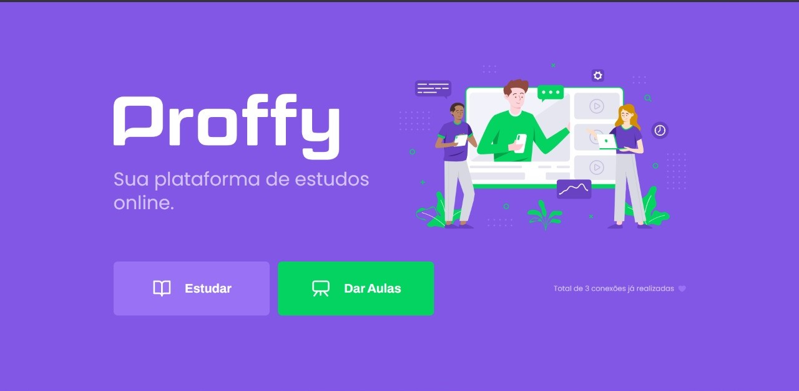
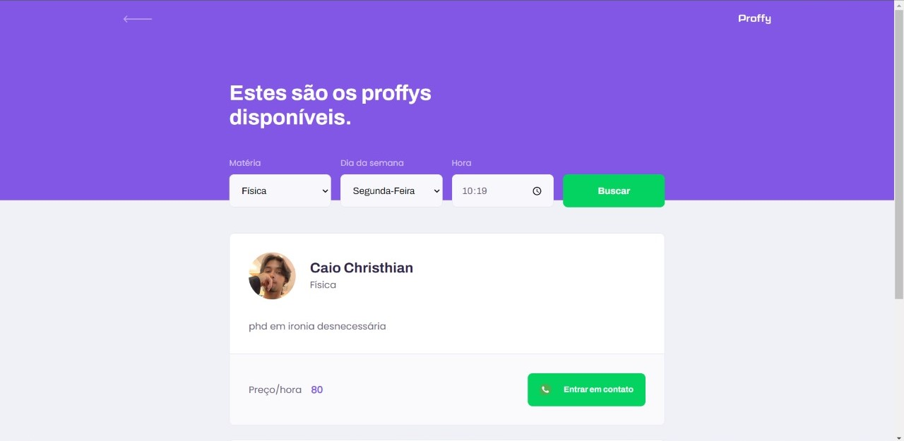
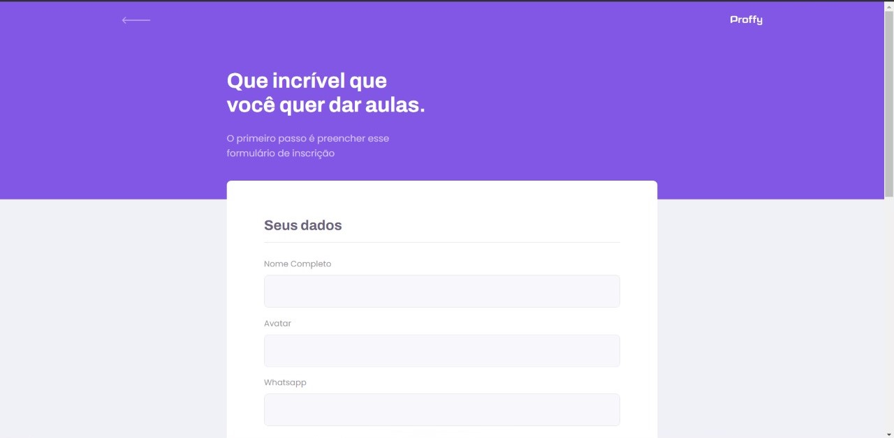
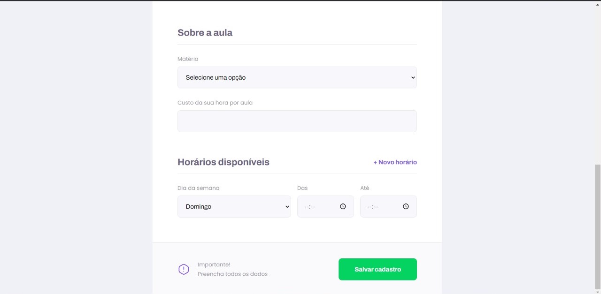
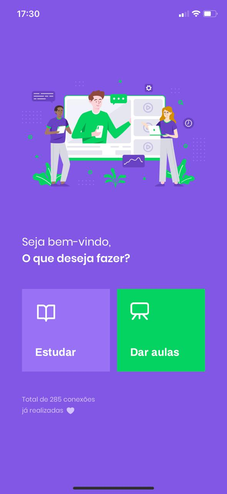
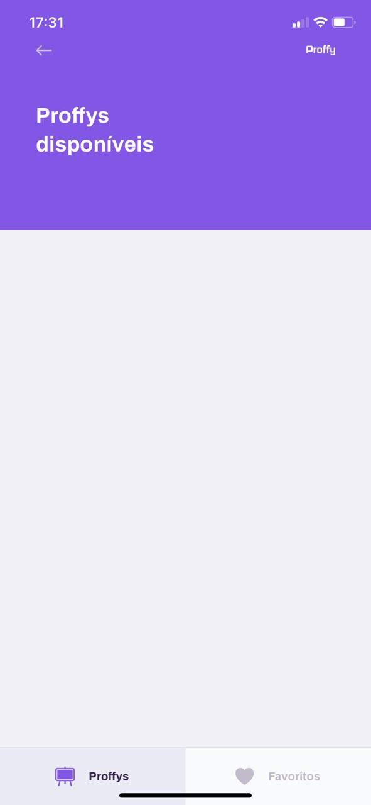

<h1 align="center">
    Proffy 
</h1>

  <a href="#-tecnologias">Tecnologias</a>&nbsp;&nbsp;&nbsp;|&nbsp;&nbsp;&nbsp;
  <a href="#-projeto">Projeto</a>&nbsp;&nbsp;&nbsp;|&nbsp;&nbsp;&nbsp;

 

Landing

  

 

Teacher List

  

 

Teacher Form

  

 

Teacher Form

  

 

Landing Mobile

  

 

Teacher List Mobile

  

 

Teacher Form Mobile

  

## 🚀 Tecnologias

Esse projeto foi desenvolvido com as seguintes tecnologias:

- TypeScript
- CSS
- React
- Knex
- Expo
- SQlite

## 💻 Projeto

Este projeto foi feito para melhorar minhas skills em programação.
